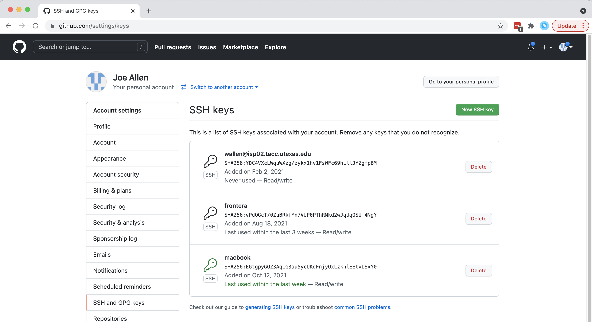

Version Control with Git
========================

.. contents:: Table of Contents
   :depth: 2

This material contains a short introduction to the version control system
**Git**. Of the numerous version control systems available (Git, Subversion,
CVS, Mercurial, etc.), Git is the most popular. What it lacks in user-friendliness
it makes up for in good documentation. We generally find that it is great for:

* Collaborating with others on code
* Supporting multiple concurrent versions (branches)
* Tagging releases or snapshots in time
* Restoring previous versions of files
* Intuitive web platforms available

After working through this material, students should be able to:

* Create a new Git repository hosted on GitHub
* Clone a repository, commit and push changes to the repository
* Track the history of changes in files in a Git repository
* Work collaboratively with others on the content in a Git repository
* Demonstrate a basic understanding of forking, branching, and tags

The Basics of Version Control
-----------------------------

Version control systems start with a base version of the document and then
record changes you make each step of the way. You can think of it as a recording
of your progress: you can rewind to start at the base document and play back
each change you made, eventually arriving at your more recent version.

.. figure:: ./images/play-changes.svg
    :width: 400px
    :align: center

    Changes are saved sequentially.

Once you think of changes as separate from the document itself, you can then
think about "playing back" different sets of changes on the base document,
ultimately resulting in different versions of that document. For example, two
users can make independent sets of changes on the same document.

.. figure:: ./images/versions.svg
    :width: 250px
    :align: center

    Different versions can be saved.

Unless there are conflicts, you can even incorporate two sets of changes into
the same base document.

.. figure:: ./images/merge.svg
    :width: 250px
    :align: center

    Multiple versions can be merged.

A version control system is a tool that keeps track of these changes for us,
effectively creating different versions of our files. It allows us to decide
which changes will be made to the next version (each record of these changes is
called a "commit", and keeps useful metadata about them. The complete history of
commits for a particular project and their metadata make up a "repository".
Repositories can be kept in sync across different computers, facilitating
collaboration among different people.

Set up Git / GitHub
-------------------

Git
~~~

When we use Git on a new machine for the first time, we need to configure a few
things. Below are a few examples of configurations we will set as we get started
with Git:

* Our name and email address,
* Default main branch name,
* And that we want to use these settings globally (i.e. for every project).

Git comes with a nice command line interface to help configure, and to navigate
and perform all of the version control features. The command line interface
takes the form ``git verb``, where ``verb`` is what we actually want to do.

To get started with an example, log on to Frontera and check which version of
Git is in your ``PATH``.

.. code-block:: console

   [local]$ ssh username@frontera.tacc.utexas.edu   # use your account
   (enter password)
   (enter token)

   [fta]$ which git
   /opt/apps/git/2.24.1/bin/git
   [fta]$ git version
   git version 2.24.1

Since you are the only one who can log in to Frontera with your username, it is
safe and reasonable to configure Git globally with your name and e-mail address:

.. code-block:: console

   [fta]$ git config --global user.name "Joe Allen"
   [fta]$ git config --global user.email "wallen@tacc.utexas.edu"
   [fta]$ git config --global init.defaultBranch main

Please use your own name and email address. This user name and email will be
associated with your subsequent Git activity, which means that any changes
pushed to
`GitHub <https://github.com/>`_,
`Bitbucket <https://bitbucket.org/>`_,
`GitLab <https://gitlab.com/>`_ or
another Git host server in the future will include this information.

EXERCISE
~~~~~~~~

* Type ``git help`` on the command line and take a few minutes to read the help
  text.

GitHub
~~~~~~

GitHub is a web platform where you can host and share Git repositories
("repos"). Repositories can be public or private. Much of what we will do with
this section requires you to have a GitHub account. First sign up for a GitHub
account:

    Click on 'Sign up' in the top right

GitHub has recently gotten more serious about security. Simple username /
password authentication is no longer accepted from the Git command line. The
easiest way to authenticate with GitHub via the command line is with SSH keys.
Once logged in to GitHub, click on your avatar in the top right corner, choose
"Settings", and choose "SSH and GPG keys":

    Click on your avatar in the top right, then 'Settings'

    Click on 'SSH and GPG keys' on the left-hand side

    Click on 'New SSH Key'

Back on Frontera, you will need to grab a copy of your SSH **public key** and
paste it into the GitHub key manager. To find the public key on Frontera,
execute:

.. code-block:: console

    [fta]$ cat ~/.ssh/id_rsa.pub
    ssh-rsa AAAAB3NzaC1yc2EAAAADAQABAAABAwhWa3/RZwaTrAqXE/VnUsTry3N9MCGXPvRLRj+R
    TtbANqFg00VR0bAvKTQVd0c3tGmx3Hmbg58JRd0og49HHC3U0v+CiFw6UFk/8S8bJC9VITjkHwy+
    HEzDX9UpNrpf1DCuzUH+aP9fkqS/BgMmgjOStObLW4O6vIXoi1Tm/j6NDjrd51B6XwNRZvUarfRM
    n6wyBP28K+YzWEabDVucNw0byr9ikGx7xhMtFxwz6k+7AfMepize1zk9WZnp6Z24T+qGU4ulBLIw
    3tm+YL8epe6aIFV7J0vV3nb7WG/L0B3NDPl4L wallen@login1.frontera.tacc.utexas.edu

Now you are all ready to interact with the Git repos hosted on GitHub from
Frontera.

.. tip::

   A key benefit of Git is that it is platform agnostic. You can use it
   to interact with the same files from your laptop, from a lab computer, or
   from a cluster.

Get Started with a New Repository
---------------------------------

Let's create a new directory on Frontera and use Git commands to initialize it
as a Git repository.

.. code-block:: console

    [fta]$ cd ~/                # cd to your home dir
    [fta]$ mkdir my-git-repo/   # make a new dir
    [fta]$ cd my-git-repo/      # cd into that new dir
    [fta]$ git init             # initialize as a git repo
    Initialized empty Git repository in /home1/03439/wallen/my-git-repo/.git/

Now, we have the option to use the version control system Git to track all of
the files we create in this directory. Not everything needs to be tracked, but
Git will generally be *aware* of everything in here unless we tell it explicitly
to ignore it.

If we use ``ls -a``, we can see that Git has created a hidden directory called
``.git``:

.. code-block:: console

   [fta]$ pwd
   /home1/03439/wallen/my-git-repo/
   [fta]$ ls -a
   ./  ../  .git/

Use the ``find`` command to get a overview of the contents of the ``.git/``
directory:

.. code-block:: console

   [fta]$ find .git/
   .git/
   .git/description
   .git/config
   .git/objects
   .git/objects/pack
   .git/objects/info
   .git/hooks
   .git/hooks/pre-merge-commit.sample
   .git/hooks/pre-rebase.sample
   .git/hooks/prepare-commit-msg.sample
   .git/hooks/update.sample
   .git/hooks/applypatch-msg.sample
   .git/hooks/pre-applypatch.sample
   .git/hooks/pre-commit.sample
   .git/hooks/commit-msg.sample
   .git/hooks/post-update.sample
   .git/hooks/fsmonitor-watchman.sample
   .git/hooks/pre-push.sample
   .git/hooks/pre-receive.sample
   .git/refs
   .git/refs/tags
   .git/refs/heads
   .git/HEAD
   .git/info
   .git/info/exclude
   .git/branches

Git uses this special sub-directory to store all the information about the
project, including all the history of changes to all files located within the
project directory and subdirectories. If we ever delete the ``.git`` directory,
we will lose the project's history. We can check that everything is set up
correctly by asking Git to tell us the status of our project:

.. code-block:: console

   [fta]$ git status
   On branch master

   No commits yet

   nothing to commit (create/copy files and use "git add" to track)

Although we configured Git to use the default branch name **main**, it seems that
does not work until version 2.28.0! To rename the base branch, do:

.. code-block:: console

   [fta]$ git checkout -b main
   [fta]$ git status
   On branch main

   No commits yet

   nothing to commit (create/copy files and use "git add" to track)

.. note::

   If you are using a different version of ``git``, the exact wording of the
   output might be slightly different. Make sure you are not using a really old
   version (< ~2.24) if you want to take advantage of all the features.

EXERCISE
~~~~~~~~

* Take a few minutes to explore the files and folders in the ``.git/`` directory.

Tracking Changes
~~~~~~~~~~~~~~~~

We will use this repository to track some simple code we are about to write.
Above, Git mentioned that it did not find anything to commit. Let's create a
new file to start tracking. Use your favorite text editor to create an easy
"Hello, world!" script in C++:

.. code-block:: cpp
   :linenos:

    #include <iostream>
    using namespace std;

    int main() {

            cout << "Hello, world!" << endl;
            return 0;
    }

If we now check the status again, Git informs you that there is a new, untracked
file. And, it provides some simple instructions on how to start tracking this
file, making it part of the **repository**.

.. code-block:: console

    [fta]$ pwd
    /home1/03439/wallen/my-git-repo/
    [fta]$ ls
    hello_world.cpp
    [fta]$ git status
    On branch main

    No commits yet

    Untracked files:
      (use "git add <file>..." to include in what will be committed)
            hello_world.cpp

    nothing added to commit but untracked files present (use "git add" to track)

Use the Git verb ``add`` to add the new file to the list of things to track:

.. code-block:: console

    [fta]$ git add hello_world.cpp
    [fta]$ git status
    On branch main

    No commits yet

    Changes to be committed:
      (use "git rm --cached <file>..." to unstage)
            new file:   hello_world.cpp

Commit Changes to the Repo
~~~~~~~~~~~~~~~~~~~~~~~~~~

Git now knows that it's supposed to keep track of ``hello_world.cpp``, but it
hasn't recorded these changes as a commit yet. To get it to do that, we need to
run one more command:

.. code-block:: console

   [fta]$ git commit -m "started tracking hello world program"
   [main (root-commit) 50b4adc] started tracking hello world program
    1 file changed, 8 insertions(+)
    create mode 100644 hello_world.cpp

When we run ``git commit``, Git takes everything we have told it to save by
using ``git add`` and stores a copy permanently inside the special ``.git``
directory. This permanent copy is called a "commit" (or "revision") and its
short identifier is ``50b4adc``. Your commit will have a different identifier.

We use the ``-m`` flag ("m" for "message") to record a short, descriptive, and
specific comment that will help us remember later on what we did and why. Good
commit messages start with a brief (<50 characters) statement about the changes
made in the commit. Generally, the message should complete the sentence "If
applied, this commit will" `<commit message here>`. If you want to go into more
detail, add a blank line between the summary line and your additional notes. Use
this additional space to explain why you made changes and/or what their impact
will be.

If we run ``git status`` now:

.. code-block:: console

   [fta]$ git status
   On branch main
   nothing to commit, working tree clean

EXERCISE
~~~~~~~~

* Create a ``Makefile`` for compiling your ``hello_world.cpp`` program. Test to
  make sure it works. Then, use ``git add <file>`` followed by
  ``git commit -m "descriptive message"`` to commit the Makefile to the repo.
  Also, do a ``git status`` in between each command.

Review the Project History
--------------------------

If we want to know what we've done recently, we can ask Git to show us the
project's history using ``git log``:

.. code-block:: console

   [fta]$ git log
   commit 2f7308543b4b339546cc680563606d9c9de87b97 (HEAD -> main)
   Author: Joe Allen <wallen@tacc.utexas.edu>
   Date:   Tue Oct 26 11:32:20 2021 -0500

       adding Makefile

   commit 50b4adc9086dfe12d5c7ec8e1e2c8b2fd26d5455
   Author: Joe Allen <wallen@tacc.utexas.edu>
   Date:   Tue Oct 26 11:29:10 2021 -0500

       started tracking hello world program

The command ``git log`` lists all commits made to a repository in reverse
chronological order. The listing for each commit includes:

* the commit's full identifier (which starts with the same characters as the
  short identifier printed by the ``git commit`` command earlier),
* the commit's author,
* when it was created,
* and the log message Git was given when the commit was created.

Add to the Repo
---------------

Let's now suppose we want to add another program to this repository. Consider
the following short program for estimating the value of pi:

.. code-block:: cpp
   :linenos:

    #include <iostream>
    #include <random>
    #include <time.h>
    using namespace std;

    int main() {

            int attempts=1000;
            int tries=0;
            int inside=0;
            double ratio=0;
            srand(time(NULL));

            while (tries < attempts) {
                    tries++;
                    if (pow(rand()/double(RAND_MAX),2) +
                        pow(rand()/double(RAND_MAX),2) < 1){
                            inside++;
                    }
            }

            ratio=4*(double(inside)/double(tries));
            cout << "Final pi estimate from " << attempts
                 << " attempts is " << ratio << endl;
    }

Copy the code above into a new file, e.g. ``pi_estimator.cpp``. Compile the code
to make sure it works, then ``git add`` and ``git commit`` in sequence.

EXERCISE
~~~~~~~~

* The above example uses 1000 random points within a unit square to estimate the
  value of pi. You feel that 1000 is not very many, and you may get a better
  estimate with more points. Use your favorite text editor to change the number
  of ``attempts`` from 1000 to ``1000000``, then recompile and make sure the code
  still works. If you are happy with the result, ``git add`` and ``git commit``
  the changes.

Check for File Changes
~~~~~~~~~~~~~~~~~~~~~~

If you made a change in the ``pi_estimator.pi`` program, when you run
``git status`` it tells you that a file it already knows about has been modified:

.. code-block:: console

   [fta]$ git status
   On branch main
   Changes not staged for commit:
     (use "git add <file>..." to update what will be committed)
     (use "git restore <file>..." to discard changes in working directory)
           modified:   pi_estimator.cpp

   no changes added to commit (use "git add" and/or "git commit -a")

The last line is the key phrase: "no changes added to commit". We have changed
this file, but we haven't told Git we will want to save those changes (which we
do with ``git add``) nor have we saved them (which we do with ``git commit``).
So let's do that now. It is good practice to always review our changes before
saving them. We do this using ``git diff``. This shows us the differences
between the current state of the file and the most recently saved version:

.. code-block:: console

    [fta]$ git diff pi_estimator.cpp
    diff --git a/pi_estimator.cpp b/pi_estimator.cpp
    index 7244743..2c0f39b 100644
    --- a/pi_estimator.cpp
    +++ b/pi_estimator.cpp
    @@ -5,7 +5,7 @@ using namespace std;

     int main() {

    -       int attempts=1000;
    +       int attempts=10000000;
            int tries=0;
            int inside=0;
            double ratio=0;

The output is a bit cryptic because it is actually a series of commands for
tools like ``patch`` telling them how to reconstruct one file given the other.
If we break it down into pieces:

* The first line tells us that Git is producing output similar to the Unix
  ``diff`` command comparing the old and new versions of the file.
* The second line tells exactly which versions of the file Git is comparing:
  ``7244743`` and ``2c0f39b`` are unique computer-generated labels for those
  versions.
* The third and fourth lines once again show the name of the file being changed.
* The remaining lines are the most interesting, they show us the actual
  differences and the lines on which they occur. In particular, the ``+`` marker
  in the first column shows where we added lines.

After reviewing our change, it's time to commit it:

.. code-block:: console

    [fta]$ git add pi-estimator.cpp
    [fta]$ git commit -m "increasing the number of attempts"
    [main 9a1578f] increasing the number of attempts
     1 file changed, 1 insertion(+), 1 deletion(-)

Git insists that we add files to the set we want to commit before actually
committing anything. This allows us to commit our changes in stages and capture
changes in logical portions rather than only large batches. As the classic Git
saying goes: **Commit early, commit often**.

EXERCISE
~~~~~~~~

* Add another target to the ``Makefile`` for compiling the ``pi_estimator.cpp``
  program. Test it out, then ``git add`` and ``git commit`` in sequence.

Directories in Git
~~~~~~~~~~~~~~~~~~

There are a couple important facts you should know about directories in Git.
First, Git does not track directories on their own, only files within them. Try
it for yourself:

.. code-block:: console

   [fta]$ mkdir directory
   [fta]$ git status
   [fta]$ git add directory
   [fta]$ git status

Note, our newly created empty directory ``directory`` does not appear in the
list of untracked files even if we explicitly add it (*via* ``git add``) to our
repository.

Second, if you create a directory in your Git repository and populate it with files,
you can add all files in the directory at once by:

.. code-block:: console

   [fta]$ git add <directory-with-files>

.. tip::

   A trick for tracking an empty directory with Git is to add a hidden file to
   the directory. People sometimes will label this ``.gitcanary``. Adding and
   committing that file to the repo's history will cause the directory it is in
   to also be tracked.

Restore Old Versions of Files
-----------------------------

We can save changes to files and see what we've changed — now how can we restore
older versions of things? Let's suppose we accidentally overwrite our file:

.. code-block:: console

   [fta]$ echo "" > pi_estimator.cpp
   [fta]$ cat pi_estimator.cpp                  # oops!

Now ``git status`` tells us that the file has been changed, but those changes
haven't been staged:

.. code-block:: console

   [fta]$ git status
   On branch main
   Changes not staged for commit:
     (use "git add <file>..." to update what will be committed)
     (use "git restore <file>..." to discard changes in working directory)
           modified:   pi-estimator.cpp

   no changes added to commit (use "git add" and/or "git commit -a")

We can put things back the way they were by using ``git checkout`` and referring
to the *most recent commit* of the working directory by using the identifier
``HEAD``:

.. code-block:: console

   [fta]$ git checkout HEAD pi_estimator.cpp
   Updated 1 path from 4afd949
   [fta]$ cat pi_estimator.cpp
   #include <iostream>
   #include <random>
   ...etc

As you might guess from its name, ``git checkout`` checks out (i.e., restores)
an old version of a file. In this case, we're telling Git that we want to
recover the version of the file recorded in ``HEAD``, which is the last saved
commit. If we want to go back even further, we can use a commit identifier
instead:

.. code-block:: console
   :emphasize-lines: 20

   [fta]$ git log
   commit 08f311e2e4c9a2c3bc9cc1cb407b6485564e54b3 (HEAD -> main)
   Author: Joe Allen <wallen@tacc.utexas.edu>
   Date:   Tue Oct 26 12:16:05 2021 -0500

       added target for pi_estimator to Makefile

   commit 9a1578fe2211912528e385937390683ae7582816
   Author: Joe Allen <wallen@tacc.utexas.edu>
   Date:   Tue Oct 26 12:11:59 2021 -0500

       increasing the number of attempts

   commit 40017224ec1f35c478779f3388b4ba5c96206c41
   Author: Joe Allen <wallen@tacc.utexas.edu>
   Date:   Tue Oct 26 12:04:01 2021 -0500

       started tracking pi-estimator program

   commit 2f7308543b4b339546cc680563606d9c9de87b97
   Author: Joe Allen <wallen@tacc.utexas.edu>
   Date:   Tue Oct 26 11:32:20 2021 -0500

       adding Makefile

   commit 50b4adc9086dfe12d5c7ec8e1e2c8b2fd26d5455
   Author: Joe Allen <wallen@tacc.utexas.edu>
   Date:   Tue Oct 26 11:29:10 2021 -0500

       started tracking hello world program

.. code-block:: console

   [fta]$ git checkout 2f73085 Makefile
   # now you have a copy the earliest version of the Makefile

Again, we can put things back the way they were by using ``git checkout``:

.. code-block:: console

   [fta]$ git checkout HEAD *
   # back to the most recently committed versions of all files

Link a Local Repository to GitHub
---------------------------------

Version control really shows its power when we begin to collaborate with
other people.  We already have most of the machinery we need to do this; the
only thing missing is to copy changes from one repository to another.

Systems like Git allow us to move work between any two repositories.  In
practice, though, it's easiest to use one copy as a central hub, and to keep it
on the web rather than on someone's laptop.  Most programmers use hosting
services like GitHub, Bitbucket, or GitLab to hold those main copies.

Let's start by sharing the changes we've made to our current project with the
world. Log in to GitHub, then click on the icon in the top right corner to
create a new repository:

.. figure:: ./images/github_new_repo.png
   :width: 400px
   :align: center

   Click 'New repository'.

As soon as the repository is created, GitHub displays a page with a URL and some
information on how to configure your local repository. Provide a descriptive name
for your new repository like ``pi-estimator`` (or whatever you want).

Note that our local repository contains our most recent version of ``pi_estimator.cpp``,
as well as a history of the changes of all of the files in the repo. But, the
remote repository on GitHub doesn't contain any memory of any files yet. The next
step is to connect the two repositories. We do this by making the GitHub
repository a "remote" for the local repository. The home page of the repository
on GitHub includes the string we need to identify it:

   Follow the instructions for pushing an existing repository.

Back on Frontera in the local Git repo, link it to the repo on GitHub and confirm
the link was created:

.. code-block:: console

   [fta]$ git remote add origin git@github.com:wjallen/pi-estimator.git
   [fta]$ git remote -v
   origin  git@github.com:wjallen/pi-estimator.git (fetch)
   origin  git@github.com:wjallen/pi-estimator.git (push)

.. attention::

   Make sure to use the URL for your repository instead of the one listed here.
   This will only work if you correctly set up SSH keys.

The name ``origin`` is a local nickname for your remote repository. We could use
something else if we wanted to, but ``origin`` is by far the most common choice.

Once the nickname ``origin`` is set up, this command will push the changes from
our local repository to the repository on GitHub:

.. code-block:: console

   [fta]$ git branch -M main
   [fta]$ git push -u origin main
   Enumerating objects: 15, done.
   Counting objects: 100% (15/15), done.
   Delta compression using up to 28 threads
   Compressing objects: 100% (13/13), done.
   Writing objects: 100% (15/15), 1.67 KiB | 284.00 KiB/s, done.
   Total 15 (delta 3), reused 0 (delta 0)
   remote: Resolving deltas: 100% (3/3), done.
   To github.com:wjallen/pi-estimator.git
    * [new branch]      main -> main
   Branch 'main' set up to track remote branch 'main' from 'origin'.

Clone the Repository
~~~~~~~~~~~~~~~~~~~~

Spend a few minutes browsing the web interface for GitHub. Now, anyone can make
a full copy of ``my_first_repo`` including all the commit history by performing:

.. code-block:: console

   [fta]$ git clone git@github.com:wjallen/pi-estimator.git
   Cloning into 'pi-estimator'...
   remote: Enumerating objects: 15, done.
   remote: Counting objects: 100% (15/15), done.
   remote: Compressing objects: 100% (10/10), done.
   remote: Total 15 (delta 3), reused 15 (delta 3), pack-reused 0
   Receiving objects: 100% (15/15), done.
   Resolving deltas: 100% (3/3), done.

Collaborate with Others
-----------------------

A public platform like GitHub makes it easier than ever to collaborate with
others on the content of a repository. You can have as many local copies of a
repository as you want, but there is only one "origin" repository - the
repository hosted on GitHub. Other repositories may fall behind the origin, or
have changes that are ahead of the origin. A common model for juggling multiple
repositories where separate individuals are working on different features is the
`GitFlow model <https://datasift.github.io/gitflow/IntroducingGitFlow.html>`_:

.. figure:: ./images/GitFlowMasterBranch.png
   :width: 500px
   :align: center

   GitFlow model

Some important definitions (most can easily be managed right in the GitHub web
interface):

Fork
~~~~

A fork is a personal copy of another user's repository that lives on your
account. Forks allow you to freely make changes to a project without affecting
the original. Forks remain attached to the original, allowing you to submit a
pull request to the original's author to update with your changes. You can also
keep your fork up to date by pulling in updates from the original.

Branch
~~~~~~

A branch is a parallel version of a repository. It is contained within the
repository, but does not affect the primary or main branch allowing you to
work freely without disrupting the "live" version. When you've made the changes
you want to make, you can merge your branch back into the main branch to
publish your changes. For more information, see
`About branches <https://help.github.com/articles/about-branches>`_.

Tag
~~~

Git has the ability to tag specific points in history as being important.
Typically people use this functionality to mark release points (v1.0, and so
on).

Pull Request / Merge Request
~~~~~~~~~~~~~~~~~~~~~~~~~~~~

Pull requests are proposed changes to a repository submitted by a user and
accepted or rejected by a repository's collaborators. Like issues, pull requests
ach have their own discussion forum. For more information, see `About pull
requests <https://help.github.com/articles/about-pull-requests>`_.

Other Considerations
~~~~~~~~~~~~~~~~~~~~

Most repos will also contain a few standard files in the top directory,
including:

**README.md**: The landing page of your repository on GitHub will display the
contents of README.md, if it exists. This is a good place to describe your
project and list the appropriate citations.

**LICENSE.txt**: See if your repository needs a license
`here <https://help.github.com/articles/licensing-a-repository/>`_.

Additional Resources
--------------------

* Some of the materials in this module were based on `Software Carpentry <https://github.com/swcarpentry/git-novice>`_ DOI: 10.5281/zenodo.57467.
* `GitHub Glossary <https://help.github.com/articles/github-glossary/>`_
* `About Branches <https://help.github.com/articles/about-branches>`_
* `About Pull Requests <https://help.github.com/articles/about-pull-requests>`_
* `About Licenses <https://help.github.com/articles/licensing-a-repository/>`_
* `GitFlow Model <https://datasift.github.io/gitflow/IntroducingGitFlow.html>`_
* `More on different git workflows <https://www.atlassian.com/git/tutorials/comparing-workflows>`_
